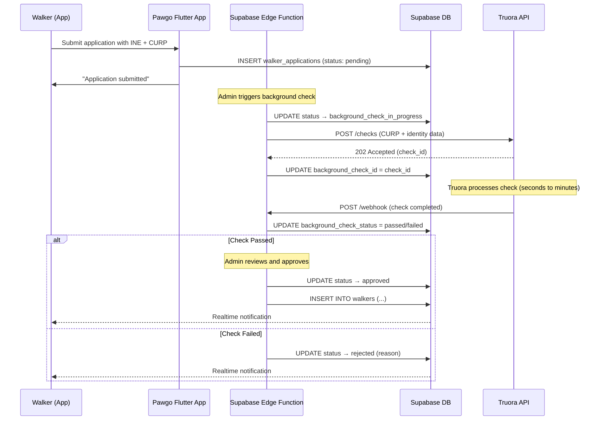

# Background Check Vendors for Mexico — Research & Recommendation

**Date:** 2026-03-22
**Context:** Pawgo dog-walking platform — walker onboarding identity/background verification

---

## 1. Vendor Comparison

### 1.1 MetaMap (formerly Mati)

| Attribute | Details |
|---|---|
| **HQ** | San Francisco / Mexico City |
| **Mexico checks** | INE validation, CURP validation, Court Records (instantaneous), Document OCR, Facial biometrics, Liveness detection |
| **API** | REST API, Button SDK, Direct Link — well-documented at docs.metamap.com |
| **Pricing** | Custom / per-transaction (charged per lookup). No public price list; contact sales |
| **Integration complexity** | Medium — SDK or API; webhooks for async results |
| **Turnaround** | Mexico court records: **instantaneous**. Document + biometric: seconds |
| **Strengths** | Strong Mexico-specific GovChecks (INE, CURP endpoints), automated court records for Mexico, 650+ customers globally, SDK for mobile onboarding |
| **Weaknesses** | No public pricing; custom sales process for every customer |

### 1.2 Truora

| Attribute | Details |
|---|---|
| **HQ** | Bogotá, Colombia (Y Combinator-backed) |
| **Mexico checks** | CURP via RENAPO, Criminal records, Identity verification (document OCR + facial), International sanctions, Professional background |
| **API** | REST API (dev.truora.com), well-documented with guides and sandbox |
| **Pricing** | 10 volume-based plans, from 100 checks/month up to 6,000+/year. Per-check pricing decreases with volume. Free trial available |
| **Integration complexity** | Low-Medium — straightforward REST API, webhooks for results |
| **Turnaround** | Identity verification: seconds. Background checks: minutes to hours depending on type |
| **Strengths** | LatAm-first company — deep Mexico/LatAm expertise, transparent volume-based pricing, free trial, RENAPO (CURP) integration built-in |
| **Weaknesses** | Less global coverage outside LatAm; smaller brand than MetaMap |

### 1.3 Emptor

| Attribute | Details |
|---|---|
| **HQ** | Mexico City |
| **Mexico checks** | CURP validation (RENAPO), RFC validation, NSS (Social Security) validation, Criminal records, International sanctions (UN, OFAC, EEAS, World Bank), USA criminal records |
| **API** | REST API, dashboard, integrations with ATS systems (Greenhouse) |
| **Pricing** | Custom pricing; free trial available. Major clients include DiDi, Kavak |
| **Integration complexity** | Low-Medium — API + dashboard |
| **Turnaround** | Identity validation: **seconds**. Criminal records: varies |
| **Strengths** | Mexico-native company — deepest Mexico-specific coverage (CURP, RFC, NSS, criminal), trusted by major Mexican platforms (DiDi, Kavak), G2 rating 4.8/5 |
| **Weaknesses** | Less documentation publicly visible; smaller engineering community |

### 1.4 Nubarium

| Attribute | Details |
|---|---|
| **HQ** | Mexico |
| **Mexico checks** | CURP validation, RFC validation, INE/IFE OCR + data extraction, Facial comparison, Cédula Profesional (SEP), IMSS/ISSSTE history, OFAC list, SPEI (CEP) |
| **API** | REST API (documenter.nubarium.com), also available on RapidAPI |
| **Pricing** | Not publicly listed; contact sales. Available on RapidAPI (pay-per-use) |
| **Integration complexity** | Low — simple REST endpoints, RapidAPI option for quick start |
| **Turnaround** | Automated checks: seconds |
| **Strengths** | Mexico-focused with broad government database coverage (CURP, RFC, INE, IMSS, ISSSTE), RapidAPI availability for easy prototyping |
| **Weaknesses** | Smaller company, less documentation, no criminal records check (focuses on identity validation) |

### 1.5 Veriff

| Attribute | Details |
|---|---|
| **HQ** | Tallinn, Estonia (global) |
| **Mexico checks** | INE + CURP combined database verification, Document verification, Facial biometrics |
| **API** | REST API, SDKs (iOS, Android, Web) |
| **Pricing** | Custom; enterprise-focused |
| **Integration complexity** | Medium — SDK-based onboarding flow |
| **Turnaround** | Seconds (automated) |
| **Strengths** | Global identity platform, good mobile SDKs, combined INE+CURP verification |
| **Weaknesses** | Not LatAm-focused; likely more expensive; no criminal record checks for Mexico |

---

## 2. Mexico-Specific Considerations

### 2.1 Key Identity Documents

| Document | Description | Verification Use |
|---|---|---|
| **INE** (Instituto Nacional Electoral) | Voter ID card — most widely used government ID in Mexico | Primary photo ID verification via OCR + database lookup |
| **CURP** (Clave Única de Registro de Población) | 18-character unique population registry code | Identity confirmation via RENAPO database |
| **RFC** (Registro Federal de Contribuyentes) | Tax ID number | Secondary identity/tax status verification |
| **NSS** (Número de Seguridad Social) | Social security number | Employment history verification |

### 2.2 Criminal Records in Mexico

- Mexico does **not** have a single unified national criminal records database
- Criminal records are maintained at the **state level** (32 states)
- Federal records are maintained separately
- Court records (expedientes judiciales) are the most reliable automated source
- MetaMap offers **instantaneous** automated Mexican court record lookups
- Truora and Emptor offer criminal checks but turnaround may vary by state

### 2.3 RENAPO Database

- The Registro Nacional de Población is the authoritative source for CURP validation
- All vendors that offer CURP checks query RENAPO
- Returns: full name, date of birth, gender, birth state
- Useful for cross-referencing applicant-provided information

### 2.4 Regulatory Considerations

- Mexico's **Ley Federal de Protección de Datos Personales en Posesión de los Particulares** (LFPDPPP) governs personal data handling
- Explicit consent required before running background checks
- Data must be stored securely and only used for stated purposes
- Walker applicants must consent to background check and understand what data is collected

---

## 3. Checks Most Relevant for a Dog-Walking Platform

For Pawgo's walker onboarding, the following checks are recommended in priority order:

1. **Identity Verification (INE + CURP)** — Critical. Confirm the person is who they claim to be
2. **Criminal History (Court Records)** — Critical. Safety of pets and pet owners
3. **Address Verification** — Nice to have. Confirm service area matches actual residence
4. **International Sanctions** — Low priority but cheap to add (OFAC/UN lists)

We do **not** need employment verification, education checks, or credit checks for a dog-walking platform.

---

## 4. Recommendation

### Primary Vendor: **Truora**

**Justification:**
- **LatAm-first** — built specifically for the Latin American market with deep Mexico expertise
- **Best API developer experience** — well-documented REST API with sandbox, guides, and free trial
- **Volume-based transparent pricing** — 10 plans from 100 to 6,000+ checks/year, scaling well for a growing platform
- **Comprehensive Mexico coverage** — CURP (RENAPO), criminal records, identity document verification, international sanctions
- **Y Combinator-backed** — well-funded and growing
- **Free trial** — allows us to prototype the integration before committing

**Integration approach:**
1. Create Truora API key
2. Initiate identity check (INE document + selfie + CURP)
3. Initiate background check (criminal records via CURP)
4. Receive results via webhook
5. Store status in `walker_applications` table

### Backup Vendor: **MetaMap**

**Justification:**
- **Instantaneous Mexican court records** — fastest criminal record lookups
- **Strong mobile SDK** — can embed verification flow directly in the Flutter app
- **INE + CURP GovChecks** — dedicated API endpoints for Mexican government databases
- **Larger global presence** — 650+ customers, more mature platform

**When to switch to MetaMap:**
- If Truora's criminal record turnaround is too slow for our use case
- If we need a more polished in-app SDK experience
- If we expand beyond Mexico and need broader international coverage

### Honorable Mention: **Emptor**

- Mexico-native company with excellent coverage
- Used by DiDi and Kavak (similar gig-economy platforms)
- Worth revisiting if we need NSS/RFC verification or deeper Mexico-specific checks

---

## 5. Cost Estimation

| Scenario | Estimated Monthly Volume | Estimated Cost |
|---|---|---|
| MVP / Launch | 10–50 applications/month | Free trial → low-tier plan |
| Growth | 100–500 applications/month | Mid-tier plan (~$200–500/month estimated) |
| Scale | 500+ applications/month | Volume discount negotiation |

*Note: Exact pricing requires sales contact. Truora offers the most transparent volume-based model.*

---

## 6. Implementation Plan

```
Phase 1 (MVP): Mock integration
  - Stub the background check API calls
  - Use mock webhook responses for testing
  - Focus on the application flow UI

Phase 2: Truora sandbox integration
  - Integrate Truora API in sandbox mode
  - Test CURP validation + criminal check flow
  - Validate webhook handling

Phase 3: Production
  - Switch to production API keys (stored in Supabase secrets)
  - Configure production webhook endpoint
  - Monitor check results and turnaround times
```

---

## 7. Architecture: Background Check Flow



---

## 8. Testing the Background Check Flow

### During Development (Mock Mode)

For development and testing, the background check vendor API will be **mocked**:

1. **Edge Function** accepts the application and immediately returns a mock `check_id`
2. A second Edge Function simulates the webhook callback (can be triggered manually or via a test endpoint)
3. The mock always returns "passed" in development, with an option to test "failed" scenarios

### Testing with Two Physical Devices

You don't need two physical devices to test the background check flow specifically — it's a backend process. However, to test the full walker experience:

1. **Device 1 (or Simulator):** Log in as an **owner** — submit a walker application
2. **Device 2 (or Browser via Supabase Studio):** Act as **admin** — trigger the background check, then approve/reject the application
3. **Device 1:** Observe Realtime status updates on the application status screen

### Testing with Truora Sandbox

Truora provides a **sandbox environment** with test API keys:

1. Sign up at [dev.truora.com](https://dev.truora.com)
2. Use sandbox API key in the Edge Function
3. Submit test CURP values that Truora provides for sandbox testing
4. Webhook responses come back with test results (configurable pass/fail)

### Broadcasting GPS Signal (Related Context)

The GPS tracking feature (already implemented) works as follows:
- **Walker's device** broadcasts GPS coordinates via `GpsBroadcastService` → writes to `walk_locations` table
- **Owner's device** subscribes to Realtime changes on `walk_locations` filtered by `booking_id`
- Both devices need internet connectivity (WiFi or mobile data)
- Testing requires either two physical devices or one device + Supabase Studio to observe the location updates in the database

To test with two physical devices:
1. Both devices run the Pawgo app pointed at the same Supabase instance (local or production)
2. Walker starts the walk → GPS broadcasting begins automatically
3. Owner opens the active walk screen → sees the walker's location update in real-time on the map
