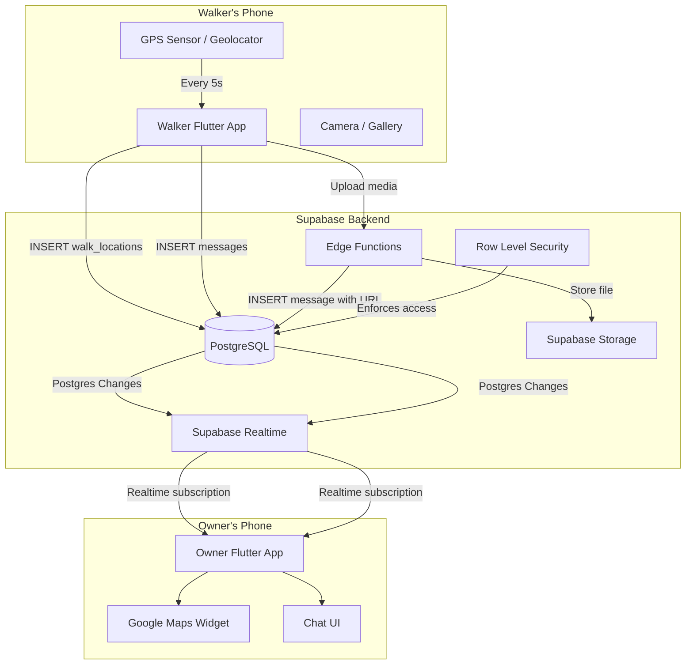
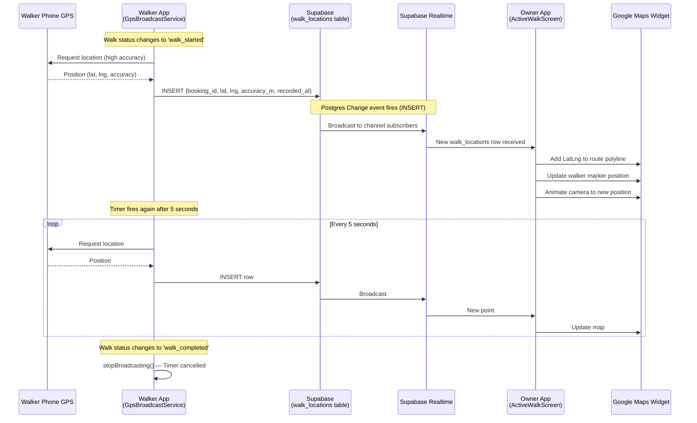
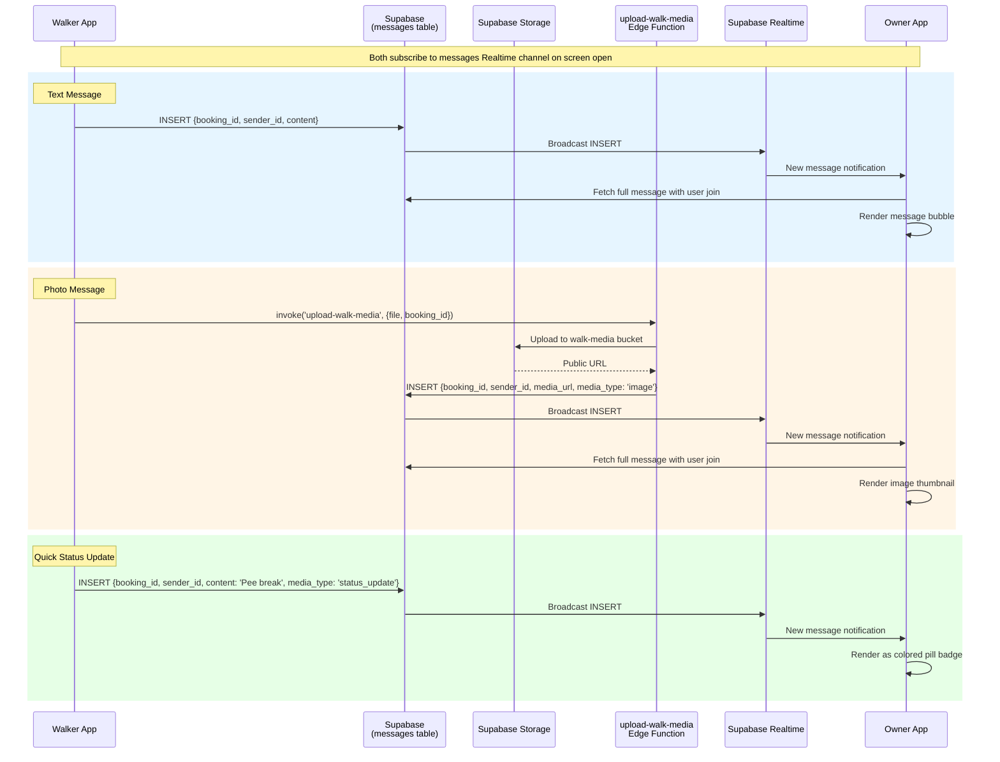
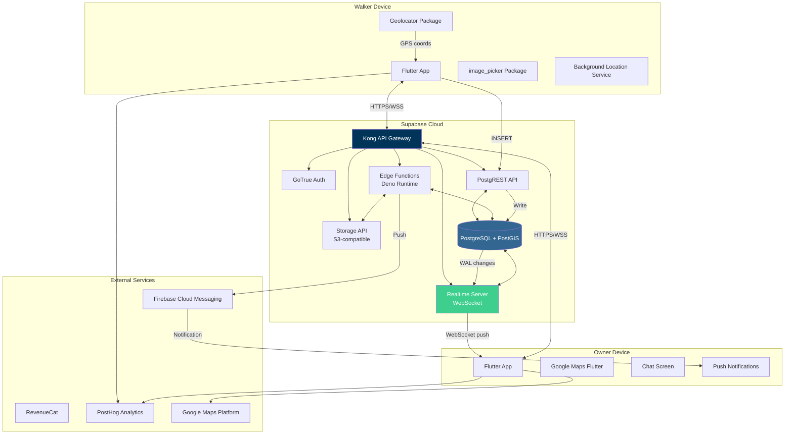

# Pawgo: Live GPS Walk Tracking & Walk Chat Architecture

This document covers how real-time GPS tracking and walk chat work in Pawgo, including data flows, table schemas, Supabase Realtime configuration, and how to test with physical devices.

---

## Table of Contents

1. [System Overview](#system-overview)
2. [GPS Tracking Architecture](#gps-tracking-architecture)
3. [Walk Chat Architecture](#walk-chat-architecture)
4. [Database Schema](#database-schema)
5. [Production Architecture](#production-architecture)
6. [Testing Guide](#testing-guide)

---

## System Overview

Pawgo uses **Supabase Realtime** (Postgres Changes) as the transport layer for both GPS location updates and chat messages. The walker's Flutter app writes data to Supabase tables, and the pet owner's app subscribes to changes on those tables filtered by `booking_id`.



---

## GPS Tracking Architecture

### How GPS Data Flows

The walker's phone captures GPS coordinates every 5 seconds and inserts them into the `walk_locations` table. The pet owner's app subscribes to Supabase Realtime Postgres Changes on that table, filtered by `booking_id`, to receive updates near-instantly.



### GPS Broadcast Service (Walker Side)

**File:** `lib/services/gps_broadcast_service.dart`

The `GpsBroadcastService` is a **singleton** that persists across screen navigation. This is critical — the walker can navigate away from the active walk screen and GPS broadcasting continues in the background.

**Key behaviors:**
- **Start:** `startBroadcasting(bookingId)` — requests location permissions, sends initial position immediately, then starts a 5-second `Timer.periodic`
- **Stop:** `stopBroadcasting()` — cancels the timer, clears state
- **Resume:** `resumeIfActiveWalk()` — called on app startup; queries for active walks assigned to the current walker and resumes broadcasting if found
- **Accuracy:** Uses `LocationAccuracy.high` with `distanceFilter: 0` (reports every position, not just when moved)
- **Battery:** High accuracy is intentional for walking use case; the 5-second interval balances accuracy with battery life

**Permissions required:**
| Platform | Permission | Purpose |
|----------|-----------|---------|
| iOS | `NSLocationWhenInUseUsageDescription` | Foreground GPS |
| iOS | `NSLocationAlwaysAndWhenInUseUsageDescription` | Background GPS |
| iOS | `UIBackgroundModes: [location]` | Background execution |
| Android | `ACCESS_FINE_LOCATION` | GPS access |
| Android | `ACCESS_BACKGROUND_LOCATION` | Background GPS |
| Android | `FOREGROUND_SERVICE` + `FOREGROUND_SERVICE_LOCATION` | Background service |

### GPS Receiver (Owner Side)

**File:** `lib/screens/active_walk_screen.dart`

The owner's `ActiveWalkScreen` does three things on load:

1. **Load existing locations** — Fetches all `walk_locations` rows for the booking (ordered by `recorded_at ASC`) to draw the route so far
2. **Subscribe to new locations** — Sets up a Supabase Realtime channel on `walk_locations` filtered by `booking_id` for INSERT events
3. **Render on Google Maps** — Maintains a `List<LatLng>` of route points, draws a blue polyline, and places a marker at the walker's current position

**GPS Signal Lost Detection:**
- A 30-second timeout timer is reset on each new GPS point
- If no point arrives within 30 seconds, a "SIGNAL LOST" warning badge appears
- The last known position marker remains on the map

**Walk Stats Displayed:**
- Elapsed time (calculated from `booking.started_at`)
- Distance traveled (Haversine formula across all route points)
- Total GPS points collected

### Realtime Subscription Setup (Owner)

```dart
// Subscribe to GPS location updates for this booking
_locationChannel = Supabase.instance.client
    .channel('walk_locations_$_bookingId')
    .onPostgresChanges(
      event: PostgresChangeEvent.insert,
      schema: 'public',
      table: 'walk_locations',
      filter: PostgresChangeFilter(
        type: PostgresChangeFilterType.eq,
        column: 'booking_id',
        value: _bookingId!,
      ),
      callback: (payload) {
        final newRecord = payload.newRecord;
        final lat = (newRecord['lat'] as num).toDouble();
        final lng = (newRecord['lng'] as num).toDouble();
        // Update map...
      },
    )
    .subscribe();
```

---

## Walk Chat Architecture

### How Chat Messages Flow

Both the walker and owner can send text messages, photos/videos, and quick status updates. All messages go through the `messages` table with Supabase Realtime broadcasting INSERTs to both participants.



### Message Types

| Type | `media_type` | `content` | `media_url` | Rendering |
|------|-------------|-----------|-------------|-----------|
| Text | `NULL` | Message text | `NULL` | Chat bubble (orange=sender, white=receiver) |
| Photo | `'image'` | Optional caption | Image URL | Thumbnail (220x180) with tap-to-expand |
| Video | `'video'` | Optional caption | Video URL | Dark container with play icon |
| Status | `'status_update'` | Status text | `NULL` | Centered colored pill badge with icon |

### Available Quick Status Updates

| Status | Content Text | Icon | Color |
|--------|-------------|------|-------|
| Pee break | "Pee break completed" | Pets icon | Orange |
| Poop | "Poop pickup completed" | Eco icon | Green |
| Water | "Water break taken" | Water drop icon | Blue |

### Chat Realtime Subscription

```dart
// Subscribe to new chat messages for this booking
_channel = _supabase
    .channel('messages:$_bookingId')
    .onPostgresChanges(
      event: PostgresChangeEvent.insert,
      schema: 'public',
      table: 'messages',
      filter: PostgresChangeFilter(
        type: PostgresChangeFilterType.eq,
        column: 'booking_id',
        value: _bookingId!,
      ),
      callback: (payload) {
        final newMessage = payload.newRecord;
        // Realtime INSERT doesn't include joined user data
        // Must fetch full message separately
        _fetchSingleMessage(newMessage['id'].toString());
      },
    )
    .subscribe();
```

**Important:** Realtime INSERT payloads only contain the raw table row — no FK joins. The app must fetch the full message with user join data separately via a REST query.

---

## Database Schema

### walk_locations (GPS Points)

**Migration:** `supabase/migrations/006_walk_locations.sql`

```sql
CREATE TABLE public.walk_locations (
    id          BIGSERIAL PRIMARY KEY,    -- BIGSERIAL for time-series data
    booking_id  UUID NOT NULL REFERENCES public.bookings(id) ON DELETE CASCADE,
    lat         DOUBLE PRECISION NOT NULL,
    lng         DOUBLE PRECISION NOT NULL,
    accuracy_m  DOUBLE PRECISION,          -- GPS accuracy in meters
    recorded_at TIMESTAMPTZ DEFAULT NOW()
);

-- Indexes for efficient queries
CREATE INDEX idx_walk_locations_booking_id ON public.walk_locations(booking_id);
CREATE INDEX idx_walk_locations_recorded_at ON public.walk_locations(recorded_at);
```

**RLS Policies** (from `013_rls_bookings_locations.sql`):
- **INSERT:** Only the walker assigned to the booking can insert GPS points (joins through `bookings → walkers → user_id`)
- **SELECT:** Both booking participants (owner and walker) can read GPS points

### messages (Chat Messages)

**Migration:** `supabase/migrations/007_messages.sql`

```sql
CREATE TABLE public.messages (
    id         UUID PRIMARY KEY DEFAULT gen_random_uuid(),
    booking_id UUID NOT NULL REFERENCES public.bookings(id) ON DELETE CASCADE,
    sender_id  UUID NOT NULL REFERENCES public.users(id) ON DELETE CASCADE,
    content    TEXT,                        -- NULL for media-only messages
    media_url  TEXT,                        -- Supabase Storage URL
    media_type TEXT CHECK (media_type IN ('image', 'video', 'status_update')),
    is_read    BOOLEAN DEFAULT FALSE,
    created_at TIMESTAMPTZ DEFAULT NOW()
);

CREATE INDEX idx_messages_booking_id ON public.messages(booking_id);
```

**RLS Policies** (from `014_rls_messages_reviews_payments_claims.sql`):
- **SELECT:** Both booking participants can read messages
- **INSERT:** Only booking participants can insert (with `sender_id = auth.uid()`)
- **UPDATE:** Both participants can update (e.g., mark as read)

### bookings (Walk Lifecycle)

The `bookings` table drives the walk lifecycle. GPS tracking starts when `status = 'walk_started'` and stops when `status = 'walk_completed'`.

```sql
-- Relevant status values for GPS/Chat:
-- 'confirmed'     → Walker can start the walk
-- 'walk_started'  → GPS broadcasting begins, chat is active
-- 'walk_completed'→ GPS stops, chat becomes read-only
```

### Supabase Realtime Configuration

Both `walk_locations` and `messages` tables have **Realtime enabled** via the Supabase dashboard/configuration. The Realtime server listens for Postgres WAL changes and broadcasts them to connected WebSocket clients.

**Channel naming convention:**
- GPS: `walk_locations_{booking_id}`
- Chat: `messages:{booking_id}`
- Booking status: `booking_status_{booking_id}`

---

## Production Architecture



### Data Flow Summary

| Data | Writer | Table | Transport | Reader | Latency |
|------|--------|-------|-----------|--------|---------|
| GPS coordinates | Walker app | `walk_locations` | Realtime INSERT | Owner app | ~1-3s |
| Text messages | Either party | `messages` | Realtime INSERT | Other party | ~1-2s |
| Photo messages | Walker app | `messages` (via Edge Function) | Realtime INSERT | Owner app | ~3-5s (upload + broadcast) |
| Status updates | Walker app | `messages` | Realtime INSERT | Owner app | ~1-2s |
| Walk status | Edge Functions | `bookings` | Realtime UPDATE | Both apps | ~1-2s |

### Resilience & Fallbacks

- **RealtimeManager** (`lib/services/realtime_manager.dart`) auto-reconnects channels on disconnect and falls back to REST polling every 10 seconds
- **withRetry()** wraps all Supabase REST calls with 3x exponential backoff (1s, 2s, 4s) on network errors
- **GPS resume on restart** — `GpsBroadcastService.resumeIfActiveWalk()` is called on app startup to recover from crashes/restarts
- **GPS signal lost detection** — 30-second timeout shows warning to owner, last known position remains visible

---

## Testing Guide

### Option 1: Two Physical Devices (Recommended)

This is the most realistic test. You need two phones — one acts as the walker, the other as the pet owner.

**Prerequisites:**
- Both devices on the same Wi-Fi network (for local Supabase) OR using production Supabase
- Google Maps API key configured in both devices' native config
- Two separate Supabase user accounts (one owner, one walker)

**Setup:**

1. **Start Supabase locally** (if testing locally):
   ```bash
   cd /Users/dabenson/Documents/myApps/Pawgo-api
   cp .env.example .env  # if not already done
   docker-compose up -d
   ```

2. **Configure Flutter for local dev:**
   - In `lib/config/env.dart`, set `Env.local` with your machine's LAN IP (e.g., `http://192.168.1.100:8000`) instead of `localhost` — physical devices can't reach `localhost` on your Mac
   - Set the env to `Env.local` in `main.dart`

3. **Create test accounts:**
   - Sign up as **Owner A** on Device 1
   - Sign up as **Walker B** on Device 2
   - Enable Walker B via the `enable-walker` Edge Function (or directly in DB)

4. **Create a booking:**
   - On Device 1 (Owner): Browse walkers → Select Walker B → Book a walk → Complete payment

5. **Start the walk:**
   - On Device 2 (Walker): Go to Walker Sessions → Find the confirmed booking → Tap "Start Walk"
   - GPS broadcasting begins automatically

6. **Verify GPS tracking:**
   - On Device 1 (Owner): Go to Bookings → Tap the active booking → Active Walk screen opens
   - You should see the walker's location marker moving on the map
   - The blue polyline traces the walker's route
   - Stats update (time, distance, GPS points)

7. **Verify chat:**
   - On either device: Tap the chat button on the Active Walk screen
   - Send text messages — they should appear on the other device within 1-2 seconds
   - Walker can send status updates (pee/poop/water) — rendered as colored pills on both devices
   - Walker can send photos — uploaded to storage, rendered as thumbnails

8. **End the walk:**
   - On Device 2 (Walker): Tap "End Walk" on the Walker Sessions screen
   - GPS broadcasting stops
   - Owner gets redirected to the review screen

### Option 2: Simulator + Physical Device

Use a physical device as the walker (real GPS) and an iOS Simulator or Android Emulator as the owner.

**Key difference:** The simulator/emulator doesn't need real GPS since it's only receiving data.

1. **Physical device (Walker):**
   - Install the app via `flutter run -d <device-id>`
   - This device provides real GPS coordinates
   - Walk around to generate real location data

2. **Simulator/Emulator (Owner):**
   - Run `flutter run -d <simulator-id>` (e.g., `iPhone 16 Pro`)
   - The simulator receives GPS data via Supabase Realtime — no GPS sensor needed
   - Google Maps renders the walker's movement on the map

**Finding device IDs:**
```bash
flutter devices
```

**Running on specific devices simultaneously:**
```bash
# Terminal 1: Walker on physical device
flutter run -d <physical-device-id>

# Terminal 2: Owner on simulator
flutter run -d <simulator-id>
```

### Option 3: Two Simulators with Simulated GPS

For pure desktop testing without physical devices.

1. **iOS Simulator GPS Simulation:**
   - In Xcode > Simulator menu > Features > Location > Custom Location
   - Or use a GPX file: Xcode > Debug > Simulate Location > Add GPX File
   - Create a GPX file with a walking route for the walker simulator

2. **Android Emulator GPS Simulation:**
   - Extended Controls (three dots) > Location
   - Set coordinates manually or load a GPX/KML route file
   - Use "Route" playback to simulate movement

**Example GPX file for walker simulation (Mexico City park walk):**
```xml
<?xml version="1.0" encoding="UTF-8"?>
<gpx version="1.1">
  <trk>
    <name>Park Walk</name>
    <trkseg>
      <trkpt lat="19.4195" lon="-99.1826"><time>2026-01-01T12:00:00Z</time></trkpt>
      <trkpt lat="19.4198" lon="-99.1823"><time>2026-01-01T12:00:05Z</time></trkpt>
      <trkpt lat="19.4201" lon="-99.1820"><time>2026-01-01T12:00:10Z</time></trkpt>
      <trkpt lat="19.4204" lon="-99.1817"><time>2026-01-01T12:00:15Z</time></trkpt>
      <trkpt lat="19.4207" lon="-99.1814"><time>2026-01-01T12:00:20Z</time></trkpt>
      <trkpt lat="19.4210" lon="-99.1811"><time>2026-01-01T12:00:25Z</time></trkpt>
    </trkseg>
  </trk>
</gpx>
```

### How the Walker Broadcasts GPS to the Owner

Here is exactly what happens under the hood:

1. **Walker taps "Start Walk"** on the Walker Sessions screen
2. The app calls the `start-walk` Edge Function, which sets `booking.status = 'walk_started'`
3. The `ActiveWalkScreen` detects `status == 'walk_started'` and the current user is the walker
4. It calls `GpsBroadcastService.instance.startBroadcasting(bookingId)`
5. The service:
   - Checks/requests location permissions via `Geolocator`
   - Immediately captures and sends the first position
   - Starts a `Timer.periodic(Duration(seconds: 5), callback)`
6. Every 5 seconds, the timer fires:
   - `Geolocator.getCurrentPosition()` gets the device GPS coordinates
   - The service does `Supabase.instance.client.from('walk_locations').insert({...})`
7. Supabase Realtime detects the INSERT via PostgreSQL WAL
8. The owner's app, which subscribed to `walk_locations` changes filtered by `booking_id`, receives the new row via WebSocket
9. The `ActiveWalkScreen` adds the new `LatLng` to the route polyline, updates the walker marker, and animates the camera

**The entire round trip (GPS capture → map update) typically takes 1-3 seconds.**

### Verifying Realtime Is Working

To confirm Supabase Realtime is properly configured:

1. Check the Supabase Dashboard > Database > Replication
2. Ensure both `walk_locations` and `messages` tables are in the publication
3. In the app, check debug console for:
   ```
   GPS broadcast started for booking: <booking-id>
   ```
4. On the owner's device, the LIVE badge should show a red dot (green if signal is active)
5. If Realtime fails, the `RealtimeManager` will fall back to REST polling every 10 seconds

### Troubleshooting

| Issue | Cause | Fix |
|-------|-------|-----|
| No GPS points appearing | Location permission denied | Check device settings, re-request permission |
| Map shows "SIGNAL LOST" | Walker's GPS not sending | Check walker's debug logs for broadcast errors |
| Chat messages delayed | Realtime disconnected | RealtimeManager should auto-reconnect; check network |
| Photos not sending | Storage bucket not configured | Ensure `walk-media` bucket exists in Supabase Storage |
| Walker marker not moving | Realtime not enabled on table | Check Supabase Dashboard > Replication settings |
| `localhost` not reachable | Physical device can't reach Mac | Use LAN IP address in `Env.local` config |
