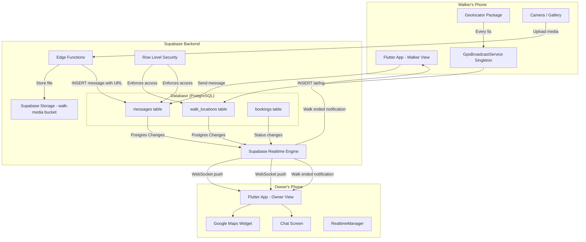
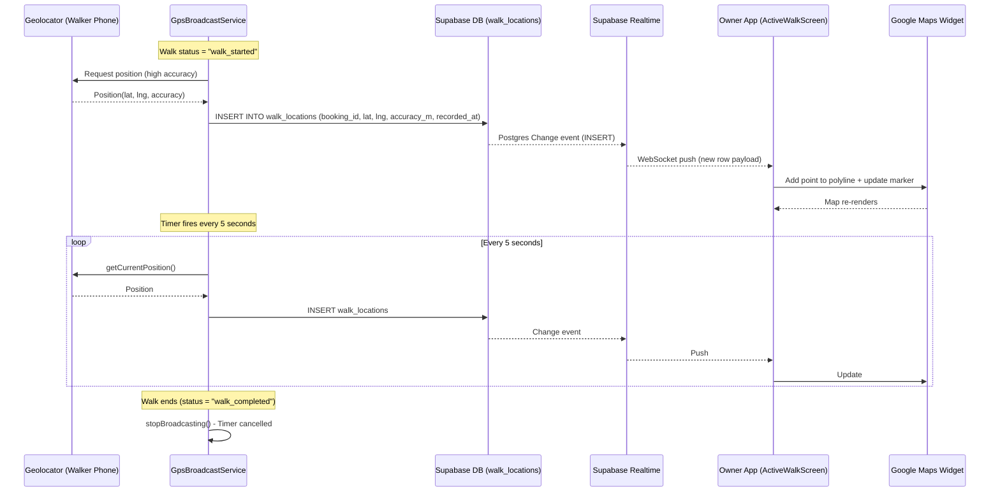
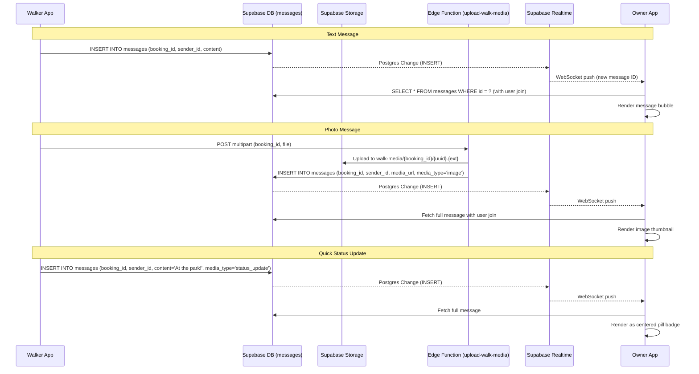
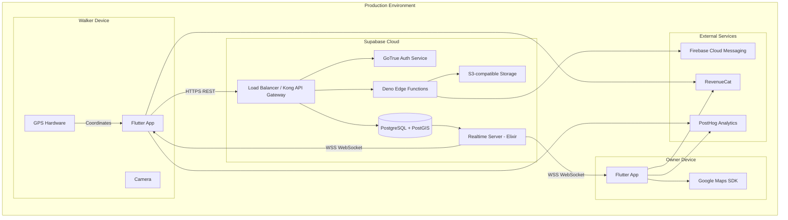

# Pawgo - Live GPS Walk Tracking & Walk Chat Architecture

## Overview

This document covers the architecture for two real-time features in Pawgo:

1. **Live GPS Tracking** - Pet owners see their dog walker's real-time location on a map
2. **Walk Chat** - Pet owners and walkers exchange text, photos, and quick status updates during active walks

Both features leverage **Supabase Realtime** (Postgres Changes) for sub-second data delivery between devices.

---

## System Architecture Diagram



---

## 1. GPS Tracking Architecture

### Data Flow: Walker Phone to Owner Map



### GPS Components

| Component | Location | Role |
|-----------|----------|------|
| `GpsBroadcastService` | `lib/services/gps_broadcast_service.dart` | Singleton that captures GPS every 5s and inserts into `walk_locations` |
| `ActiveWalkScreen` | `lib/screens/active_walk_screen.dart` | Subscribes to Realtime, renders Google Map with polyline + markers |
| `RealtimeManager` | `lib/services/realtime_manager.dart` | Auto-reconnects Realtime channels, falls back to REST polling on disconnect |
| `walk_locations` table | `supabase/migrations/006_walk_locations.sql` | Append-only GPS time-series data |

### Database Schema: `walk_locations`

```sql
CREATE TABLE public.walk_locations (
    id          BIGSERIAL PRIMARY KEY,    -- High-volume time-series, not UUID
    booking_id  UUID NOT NULL REFERENCES public.bookings(id) ON DELETE CASCADE,
    lat         DOUBLE PRECISION NOT NULL,
    lng         DOUBLE PRECISION NOT NULL,
    accuracy_m  DOUBLE PRECISION,
    recorded_at TIMESTAMPTZ NOT NULL DEFAULT NOW()
);

CREATE INDEX idx_walk_locations_booking ON walk_locations(booking_id);
CREATE INDEX idx_walk_locations_recorded ON walk_locations(recorded_at);
```

### GPS Broadcast Lifecycle

1. **Walk starts** - `start-walk` Edge Function sets booking status to `walk_started`
2. **ActiveWalkScreen detects walker role** - Compares `auth.currentUser.id` to `booking.walkers.user_id`
3. **Broadcasting begins** - `GpsBroadcastService.startBroadcasting(bookingId)` starts 5s timer
4. **App restart recovery** - `main.dart` calls `resumeIfActiveWalk()` on startup to detect and resume active broadcasts
5. **Walk ends** - `end-walk` Edge Function sets status to `walk_completed`, GPS timer is cancelled

### GPS Signal Lost Detection

- 30-second timeout timer resets on each new location point
- If no GPS point arrives in 30s, UI shows "SIGNAL LOST" badge
- Last known position remains visible on map
- Polyline continues from last known point when signal resumes

### Map Rendering Details

- **Package**: `google_maps_flutter`
- **Polyline**: Sky Blue (#3B82F6) connecting all GPS points in order
- **Walker Marker**: Current position, updates on each new point
- **Start Marker**: Green pin at first GPS point
- **Auto-center**: Map follows walker position
- **Stats**: Elapsed time (from `started_at`), distance (Haversine formula), point count

---

## 2. Walk Chat Architecture

### Message Flow



### Chat Components

| Component | Location | Role |
|-----------|----------|------|
| `WalkerChatScreen` | `lib/screens/walker_chat_screen.dart` | Chat UI with text input, media picker, status buttons |
| `upload-walk-media` | `supabase/functions/upload-walk-media/index.ts` | Validates and uploads media, creates message record |
| `RealtimeManager` | `lib/services/realtime_manager.dart` | Resilient Realtime subscription with polling fallback |
| `messages` table | `supabase/migrations/007_messages.sql` | All chat messages (text, media, status updates) |

### Database Schema: `messages`

```sql
CREATE TABLE public.messages (
    id         UUID PRIMARY KEY DEFAULT gen_random_uuid(),
    booking_id UUID NOT NULL REFERENCES public.bookings(id) ON DELETE CASCADE,
    sender_id  UUID NOT NULL REFERENCES public.users(id) ON DELETE CASCADE,
    content    TEXT,                          -- Text content (nullable for media-only)
    media_url  TEXT,                          -- Supabase Storage URL
    media_type TEXT CHECK (media_type IN ('image', 'video', 'status_update')),
    is_read    BOOLEAN DEFAULT FALSE,
    created_at TIMESTAMPTZ NOT NULL DEFAULT NOW()
);

CREATE INDEX idx_messages_booking ON messages(booking_id);
```

### Message Types

| Type | `media_type` | `content` | `media_url` | Rendering |
|------|-------------|-----------|-------------|-----------|
| Text | NULL | Message text | NULL | Chat bubble (orange=self, white=other) |
| Photo | `'image'` | NULL | Storage URL | Inline thumbnail, tap to expand |
| Video | `'video'` | NULL | Storage URL | Thumbnail with play icon |
| Status | `'status_update'` | Status text | NULL | Centered pill badge |

### Predefined Quick Status Updates

- Pee break completed
- Poop break completed
- Water break

These are sent as messages with `media_type: 'status_update'` and rendered distinctly.

---

## 3. Supabase Realtime Configuration

### How Realtime Works

Supabase Realtime uses **Postgres logical replication** to broadcast database changes over WebSocket connections. No additional configuration is needed beyond enabling Realtime on the table (done in Supabase Dashboard or via SQL).

### Channel Setup Pattern (Flutter)

```dart
// GPS tracking subscription (owner side)
final channel = Supabase.instance.client.channel('walk_locations_$bookingId');
channel.onPostgresChanges(
  event: PostgresChangeEvent.insert,
  schema: 'public',
  table: 'walk_locations',
  filter: PostgresChangeFilter(
    type: PostgresChangeFilterType.eq,
    column: 'booking_id',
    value: bookingId,
  ),
  callback: (payload) {
    final newPoint = payload.newRecord;
    // Update map with new GPS point
  },
).subscribe();

// Chat subscription
final chatChannel = Supabase.instance.client.channel('messages:$bookingId');
chatChannel.onPostgresChanges(
  event: PostgresChangeEvent.insert,
  schema: 'public',
  table: 'messages',
  filter: PostgresChangeFilter(
    type: PostgresChangeFilterType.eq,
    column: 'booking_id',
    value: bookingId,
  ),
  callback: (payload) {
    // Realtime payload doesn't include JOINs, so fetch full message:
    final messageId = payload.newRecord['id'];
    // SELECT * FROM messages WHERE id = messageId (with user join)
  },
).subscribe();
```

### Realtime Resilience

The `RealtimeManager` class handles connection drops:

1. **Disconnect detected** - Switches to REST polling every 10 seconds
2. **Polling active** - Queries latest data via standard Supabase client
3. **Reconnect attempt** - After 5 seconds, tries to re-establish Realtime channel
4. **Resume** - When Realtime reconnects, stops polling and resumes live updates

---

## 4. Row-Level Security (RLS)

### Walk Locations RLS

```sql
-- Only assigned walker can INSERT GPS points
CREATE POLICY walk_locations_insert_walker ON walk_locations FOR INSERT
WITH CHECK (
  booking_id IN (
    SELECT b.id FROM bookings b
    JOIN walkers w ON b.walker_id = w.id
    WHERE w.user_id = auth.uid() AND b.status = 'walk_started'
  )
);

-- Both owner and walker can SELECT GPS points
CREATE POLICY walk_locations_select_participant ON walk_locations FOR SELECT
USING (
  booking_id IN (
    SELECT b.id FROM bookings b
    WHERE b.owner_id = auth.uid()
    OR b.walker_id IN (SELECT id FROM walkers WHERE user_id = auth.uid())
  )
);
```

### Messages RLS

```sql
-- Participants can read messages
CREATE POLICY messages_select_participant ON messages FOR SELECT
USING (
  booking_id IN (
    SELECT id FROM bookings
    WHERE owner_id = auth.uid()
    OR walker_id IN (SELECT id FROM walkers WHERE user_id = auth.uid())
  )
);

-- Participants can send messages (sender_id must match auth user)
CREATE POLICY messages_insert_participant ON messages FOR INSERT
WITH CHECK (
  sender_id = auth.uid()
  AND booking_id IN (
    SELECT id FROM bookings
    WHERE owner_id = auth.uid()
    OR walker_id IN (SELECT id FROM walkers WHERE user_id = auth.uid())
  )
);
```

---

## 5. Production Architecture



### Production vs Development Differences

| Aspect | Development | Production |
|--------|------------|------------|
| Supabase | Local Docker stack (`docker-compose.yml`) | Supabase Cloud project |
| Database | Local PostgreSQL in Docker | Supabase managed Postgres |
| Realtime | Local Realtime container | Supabase managed Realtime (global) |
| Storage | Local MinIO-compatible | Supabase S3 storage |
| Auth | Local GoTrue | Supabase Auth (with email/SMS providers) |
| Maps API | Google Maps test key | Google Maps production key (billing enabled) |
| GPS | Physical device or simulator | Physical device only |
| Network | `localhost:8000` (Kong gateway) | `https://<project>.supabase.co` |

---

## 6. Testing Guide: How to Test with Physical Devices

### Option A: Two Physical Devices (Recommended for GPS)

This is the most realistic test scenario since GPS requires actual hardware.

**Setup:**

1. **Device 1 (Walker)** - Any iOS/Android phone with GPS
2. **Device 2 (Owner)** - Any iOS/Android phone or tablet

**Steps:**

1. **Start the Supabase local stack:**
   ```bash
   cd /Users/dabenson/Documents/myApps/Pawgo-api
   cp .env.example .env  # if not done already
   docker-compose up -d
   ```

2. **Configure Flutter to point to your local machine:**
   Edit `lib/config/env.dart` and set the local Supabase URL to your machine's **local network IP** (not `localhost`):
   ```dart
   static const local = Env(
     supabaseUrl: 'http://192.168.X.X:8000',  // Your machine's LAN IP
     supabaseAnonKey: '...',
   );
   ```
   Find your IP: `ifconfig | grep "inet " | grep -v 127.0.0.1`

3. **Create two test accounts:**
   - Account A: Pet owner (sign up with email)
   - Account B: Walker (sign up with email, then enable as walker via admin Edge Function or direct DB insert)

4. **Create test data:**
   ```sql
   -- In Supabase Studio (http://localhost:3000) or psql:
   -- 1. Add a walker profile for Account B
   INSERT INTO walkers (user_id, bio, hourly_rate_mxn, is_enabled, background_checked)
   VALUES ('<account-b-user-id>', 'Test walker', 150.00, true, true);

   -- 2. Add a dog for Account A
   INSERT INTO dogs (owner_id, name, breed, weight_kg)
   VALUES ('<account-a-user-id>', 'Buddy', 'Labrador', 25.0);
   ```

5. **Run the app on both devices:**
   ```bash
   # Terminal 1 - Walker device
   flutter run -d <walker-device-id>

   # Terminal 2 - Owner device
   flutter run -d <owner-device-id>
   ```
   List devices: `flutter devices`

6. **Test the full flow:**
   - **Owner (Device 2):** Create a booking for the walker
   - **Walker (Device 1):** Go to Walker Sessions, tap "Start Walk"
   - **Owner (Device 2):** Open the active walk screen - you should see the map
   - **Walker (Device 1):** Walk around outside - GPS points appear every 5s
   - **Owner (Device 2):** Watch the map update in real-time with the walker's route
   - **Both:** Open the chat, exchange messages and photos
   - **Walker (Device 1):** Tap "End Walk" to complete

### Option B: One Physical Device + One Simulator

**Limitation:** iOS Simulator provides fake GPS (Apple HQ by default). Android Emulator can simulate GPS routes.

**Setup:**

1. **Physical device** = Walker (needs real GPS)
2. **Simulator/Emulator** = Owner (only needs to receive data and display map)

**For Android Emulator GPS simulation:**
- Open Extended Controls (three dots on emulator toolbar)
- Go to Location tab
- Set coordinates manually or load a GPX route file
- Click "Send" to simulate movement

**For iOS Simulator:**
- Features > Location > Custom Location (set lat/lng)
- Or use "City Run" / "Freeway Drive" presets for moving simulation

**Steps:**

1. Same Supabase setup as Option A
2. Set `supabaseUrl` to `http://10.0.2.2:8000` for Android Emulator (special alias for host machine), or your LAN IP for iOS Simulator
3. Run walker app on physical device, owner app on simulator
4. Follow the same test flow as Option A

### Option C: Single Device (Limited Testing)

For quick development iteration without full end-to-end GPS testing:

1. **Run the app on one device/simulator**
2. **Manually insert GPS points** via SQL to simulate the walker:
   ```sql
   -- Simulate walker GPS broadcast
   INSERT INTO walk_locations (booking_id, lat, lng, accuracy_m)
   VALUES
     ('<booking-id>', 19.4326, -99.1332, 10.0);  -- Mexico City

   -- Wait 5 seconds, insert next point
   INSERT INTO walk_locations (booking_id, lat, lng, accuracy_m)
   VALUES
     ('<booking-id>', 19.4327, -99.1330, 10.0);  -- Slightly moved
   ```
3. **Watch the owner's map update** as each INSERT triggers Realtime

### How the Walker Broadcasts GPS to the App

The GPS broadcast flow works as follows:

1. **Permission request** - On first walk start, the app requests location permissions via the `geolocator` Flutter package
2. **`GpsBroadcastService` singleton** - Lives for the lifetime of the app process, independent of screen navigation
3. **Timer.periodic(5 seconds)** - Every 5 seconds, calls `Geolocator.getCurrentPosition()` with high accuracy
4. **Supabase INSERT** - Each position is inserted into `walk_locations` table via the Supabase Dart client (REST API with JWT auth)
5. **RLS enforcement** - The INSERT only succeeds if the authenticated user is the assigned walker for that booking
6. **Realtime broadcast** - Supabase Realtime detects the INSERT via Postgres logical replication and pushes the new row to all subscribed clients (the pet owner)
7. **Map update** - The owner's `ActiveWalkScreen` receives the WebSocket event, adds the point to the polyline, and updates the walker marker position

**Key detail:** The broadcast service is a **singleton** that persists even if the walker navigates away from the active walk screen. This means GPS keeps sending even if the walker is in the chat screen, settings, etc. The service is only stopped when the walk ends or the app is killed.

**Background GPS (iOS/Android):**
- iOS: `UIBackgroundModes` includes `location` in `Info.plist` - allows GPS capture when app is backgrounded
- Android: `FOREGROUND_SERVICE` + `FOREGROUND_SERVICE_LOCATION` permissions in `AndroidManifest.xml` - requires a foreground notification (planned enhancement)

---

## 7. Data Retention and Performance

### GPS Data Volume Estimate

- 1 point every 5 seconds = 12 points/minute = 720 points/hour
- Average walk: 30-60 minutes = 360-720 points per walk
- Each row: ~100 bytes = ~72 KB per walk
- `BIGSERIAL` PK used (not UUID) for efficient time-series storage

### Chat Message Volume

- Typical walk: 5-20 messages
- Photo messages: stored in Supabase Storage, only URL in DB
- Status updates: lightweight text messages

### Indexes

- `walk_locations(booking_id)` - Fast lookup of all GPS points for a walk
- `walk_locations(recorded_at)` - Time-range queries
- `messages(booking_id)` - Fast lookup of all messages for a walk

---

## 8. Security Considerations

1. **RLS everywhere** - All tables have Row Level Security enabled. Only walk participants can read/write their own data.
2. **Walker identification** - GPS INSERT requires JOIN through `walkers` table to verify the authenticated user is the assigned walker (not just any user).
3. **Media upload validation** - Edge Function validates file type (image/video only) and size (50MB max) before storage.
4. **Chat availability** - Chat should only be active during `walk_started` status (enforced in UI, can be reinforced in RLS).
5. **JWT auth** - All Supabase client operations use JWT tokens. Realtime WebSocket connections are authenticated.

---

## 9. Mapping to PRD User Stories

| Story | What Exists | What May Need Enhancement |
|-------|-------------|--------------------------|
| US-002 (GPS schema) | `walk_locations` table exists with proper schema | Already complete - uses `booking_id` as walk identifier |
| US-003 (Chat schema) | `messages` table exists with proper schema | May need sender_role column for owner/walker distinction |
| US-004 (Walker GPS broadcast) | `GpsBroadcastService` fully implemented | Already complete |
| US-005 (Owner Realtime GPS) | `ActiveWalkScreen` Realtime subscription exists | Already complete |
| US-006 (Map rendering) | Google Maps with polyline + markers implemented | Already complete |
| US-007 (Chat UI) | `WalkerChatScreen` with full chat UI exists | Already complete |
| US-008 (Photo messages) | Media upload via Edge Function + display implemented | Already complete |
| US-009 (Quick status) | Status updates with pill badge rendering exist | May need more predefined options |
| US-010 (Chat only during active) | UI shows chat button only during active walks | May need RLS enforcement |
| US-011 (Tests) | No dedicated tests for GPS/chat yet | Needs implementation |
